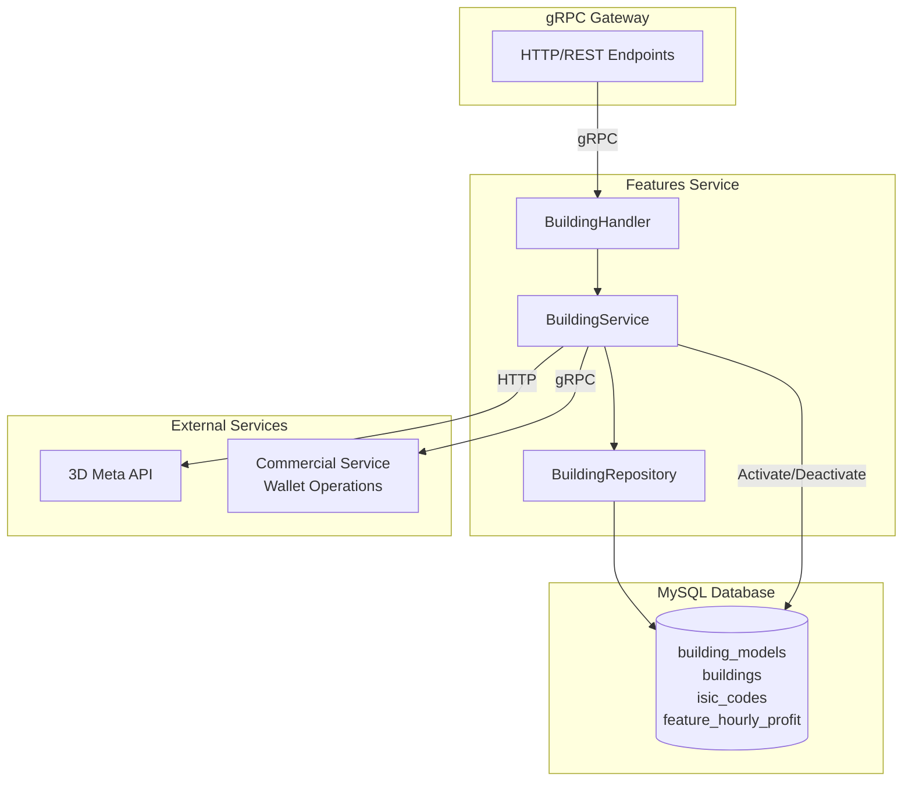

# Build Feature API - Go Implementation Plan

## Overview

The Build Feature API is already partially implemented in the Go features-service, but has several critical discrepancies from the Laravel specification documented in [`api-docs/features-service/build_feature_api.md`](api-docs/features-service/build_feature_api.md). This plan addresses these issues and completes the implementation.

## Architecture




## Critical Issues to Fix

### 1. Bubble Diameter Calculation Formula

**File:** [`services/features-service/internal/service/building_service.go`](services/features-service/internal/service/building_service.go) (lines 284-302)**Current Implementation:**

```go
diameter := math.Sqrt(area / math.Pi)
```

**Expected Implementation:**

```go
// Extract width, length, density from attributes array
// Attributes format: [{"slug": "width", "value": 50}, ...]
perimeter := 2 * (width + length)
coefficient := 1.0
for i := 1; i < density; i++ {
    coefficient += 0.3
}
diameter := perimeter * coefficient
```

**Impact:** Current formula produces incorrect collision boundaries for building placement.

### 2. Construction Duration Units

**File:** [`services/features-service/internal/service/building_service.go`](services/features-service/internal/service/building_service.go) (line 252-254)**Current:**

```go
constructionDuration := requiredSatisfaction * 288000.0 / launchedSatisfaction
constructionEndDate := constructionStartDate.Add(time.Duration(constructionDuration) * time.Second)
```

**Issue:** Formula produces hours but code treats as seconds.**Fix:**

```go
constructionDurationHours := requiredSatisfaction * 288000.0 / launchedSatisfaction
constructionEndDate := constructionStartDate.Add(time.Duration(constructionDurationHours * 3600) * time.Second)
```


### 3. Wallet Deduction in BuildFeature

**File:** [`services/features-service/internal/service/building_service.go`](services/features-service/internal/service/building_service.go) (after line 196)**Missing:** Wallet deduction before building creation.**Add:**

```go
// Deduct satisfaction from wallet before creating building
err = s.commercialClient.DeductBalance(ctx, user.UserID, "satisfaction", launchedSatisfaction)
if err != nil {
    return fmt.Errorf("failed to deduct satisfaction: %w", err)
}
```

**Placement:** After validation, before calling `DeactivateProfitsForFeature`.

### 4. Wallet Refund in DestroyBuilding

**File:** [`services/features-service/internal/service/building_service.go`](services/features-service/internal/service/building_service.go) (line 546-570)**Missing:** Retrieve original launched_satisfaction and refund to wallet.**Add:**

```go
// Get building to retrieve launched_satisfaction for refund
building, err := s.buildingRepo.FindBuildingByFeatureAndModel(ctx, featureID, buildingModelID)
if err != nil {
    return fmt.Errorf("failed to find building: %w", err)
}

launchedSat, _ := strconv.ParseFloat(building.LaunchedSatisfaction, 64)

// Delete building first
if err := s.buildingRepo.DeleteBuilding(ctx, featureID, buildingModelID); err != nil {
    return fmt.Errorf("failed to delete building: %w", err)
}

// Refund satisfaction to wallet
if err := s.commercialClient.AddBalance(ctx, user.UserID, "satisfaction", launchedSat); err != nil {
    // Log error but don't fail - building already deleted
    fmt.Printf("Warning: failed to refund satisfaction: %v\n", err)
}
```


### 5. Remove Bubble Diameter Recalculation in UpdateBuilding

**File:** [`services/features-service/internal/service/building_service.go`](services/features-service/internal/service/building_service.go) (lines 499-504)**Current:** Recalculates bubble diameter on update.**Fix:** Remove lines 499-504 and use existing building's bubble diameter:

```go
// Preserve existing bubble diameter (don't recalculate on update)
existingBubbleDiameter, _ := strconv.ParseFloat(existingBuilding.BubbleDiameter, 64)

// Update building (pass existing bubble diameter)
updatedBuilding, err := s.buildingRepo.UpdateBuilding(ctx, req.FeatureId, req.BuildingModelId,
    req.LaunchedSatisfaction, req.Rotation, req.Position, informationJSON,
    constructionEndDate, existingBubbleDiameter)
```


### 6. Fix Attribute Parsing from 3D API

**File:** [`services/features-service/internal/service/building_service.go`](services/features-service/internal/service/building_service.go) (line 265)**Current:** Unmarshals to flat map.**Issue:** 3D API returns attributes as array: `[{"slug": "width", "value": 50}, ...]`**Create Helper Function:**

```go
// extractAttributeValue extracts a value by slug from attributes array
func extractAttributeValue(attributes []map[string]interface{}, slug string) (float64, bool) {
    for _, attr := range attributes {
        if s, ok := attr["slug"].(string); ok && s == slug {
            if v, ok := attr["value"].(float64); ok {
                return v, true
            }
        }
    }
    return 0, false
}
```

**Update calculateBubbleDiameter signature:**

```go
func (s *BuildingService) calculateBubbleDiameter(attributesJSON string) float64 {
    var attributes []map[string]interface{}
    if err := json.Unmarshal([]byte(attributesJSON), &attributes); err != nil {
        return 0.0
    }
    
    width, widthOk := extractAttributeValue(attributes, "width")
    length, lengthOk := extractAttributeValue(attributes, "length")
    density, densityOk := extractAttributeValue(attributes, "density")
    
    if !widthOk || !lengthOk || !densityOk {
        return 0.0
    }
    
    perimeter := 2.0 * (width + length)
    coefficient := 1.0
    for i := 1; i < int(density); i++ {
        coefficient += 0.3
    }
    
    return perimeter * coefficient
}
```


### 7. Conditional Information Storage

**File:** [`services/features-service/internal/service/building_service.go`](services/features-service/internal/service/building_service.go) (lines 211-248)**Current:** Saves information even when activity_line is empty.**Fix:**

```go
var informationJSON string
if req.Information != nil && req.Information.ActivityLine != "" {
    // Only create information JSON if activity_line is provided
    infoMap := make(map[string]interface{})
    infoMap["activity_line"] = req.Information.ActivityLine
    
    if req.Information.Name != "" {
        infoMap["name"] = req.Information.Name
    }
    // ... rest of fields
    
    infoBytes, _ := json.Marshal(infoMap)
    informationJSON = string(infoBytes)
    
    // Create ISIC code
    _, err = s.buildingRepo.FirstOrCreateIsicCode(ctx, req.Information.ActivityLine)
    if err != nil {
        return fmt.Errorf("failed to create ISIC code: %w", err)
    }
}
// If activity_line not provided, informationJSON remains empty string
```


## Database Schema Validation

Verify these tables exist with correct columns:**`building_models`:**

- `id` (PK), `model_id` (unique), `name`, `sku`, `images` (JSON), `attributes` (JSON), `file` (JSON), `required_satisfaction`, timestamps

**`buildings`:**

- `id` (PK), `feature_id`, `model_id`, `construction_start_date`, `construction_end_date`, `launched_satisfaction`, `information` (JSON), `rotation`, `position`, `bubble_diameter`, timestamps

**`isic_codes`:**

- `id` (PK), `name` (unique), `verified`, timestamps

**`feature_hourly_profit`:**

- `id` (PK), `feature_id`, `user_id`, `asset`, `amount`, `dead_line`, `is_active`, timestamps

## Testing Strategy

1. **Unit Tests:** Create tests for `calculateBubbleDiameter` with various density values
2. **Integration Tests:** Test full build/update/destroy flow with wallet mock
3. **Edge Cases:**

- Missing attributes in building model
- Insufficient wallet balance
- Duplicate build attempts
- Update without activity_line (should preserve existing information)

## Rollout Considerations

- Update should be backward compatible with existing database records
- Existing buildings with incorrect bubble diameter will retain old values until updated
- No migration needed - fixes apply to new operations only
- Consider logging warnings for attribute parsing failures

## Files to Modify

1. [`services/features-service/internal/service/building_service.go`](services/features-service/internal/service/building_service.go) - Main business logic fixes
2. [`services/features-service/internal/handler/building_handler.go`](services/features-service/internal/handler/building_handler.go) - Minor error handling improvements
3. Add unit tests in `tests/features-service/internal/service/building_service_test.go` (new file)

## Success Criteria

- Bubble diameter matches Laravel calculation for identical inputs
- Construction end dates calculated correctly in hours
- Wallet balance decrements on build, increments on destroy
- Update preserves bubble diameter and doesn't charge wallet